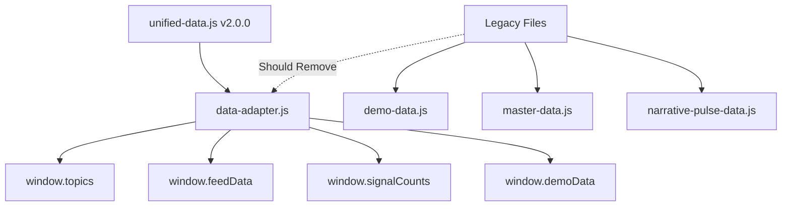

# 📋 SYNTHEA.AI CODEBASE AUDIT REPORT

**Date**: January 8, 2025  
**Auditor**: Claude Code with Gemini Deep Analysis  
**Project**: Synthea.ai VCPulse Intelligence Platform  
**Status**: Critical Technical Debt Identified

---

## 🎯 EXECUTIVE SUMMARY

The Synthea.ai VCPulse Intelligence Platform has evolved from a rapid prototype into a complex system with **two parallel implementations** and significant technical debt. The vanilla JS demo is fully functional but suffers from architectural fragmentation, while the React implementation is only ~10% complete and should be formally deprecated.

### Key Findings
- **5 conflicting implementations** of Priority Briefings component
- **State scattered across 5 different storage mechanisms**
- **7+ data files** creating confusion about source of truth
- **50+ test HTML files** without organization
- CSS architecture requiring "nuclear" DOM replacement workarounds

### Recommendation
Implement the proposed 4-week refactoring plan to consolidate components, centralize state, and establish maintainable architecture.

---

## 🏗️ ARCHITECTURE OVERVIEW

### Current Implementation Status

#### 1. Vanilla JS Demo (`/demo` folder) - PRIMARY
- **Status**: 100% functional, production-ready
- **Technology**: Pure JavaScript ES6+, HTML5, CSS3
- **Framework**: None - no build process required
- **Pattern**: Object literals with `init()` methods
- **Entry Point**: `/demo/demo.html`
- **Deployment**: Simple HTTP server (`python3 -m http.server 8000`)

#### 2. React/Next.js App (root directory) - ABANDONED
- **Status**: ~10% scaffolded
- **Components Built**: Header, Portfolio panel only
- **Technology**: Next.js 14, React 18, TypeScript, Tailwind CSS
- **Location**: `/app`, `/components` folders
- **Recommendation**: Formally deprecate and archive

---

## 🔴 CRITICAL ISSUES IDENTIFIED

### 1. Component Fragmentation Crisis

#### Priority Briefings - 5 Conflicting Implementations

| File | Size | Status | Last Modified | Notes |
|------|------|--------|---------------|-------|
| `priority-briefings-compact.js` | 5.4KB | **ACTIVE** ✅ | Aug 8 | Currently loaded in demo.html |
| `priority-briefings.js` | 23KB | Unused | Aug 8 | Main implementation, conflicts with compact |
| `priority-briefings-dynamic.js` | 30KB | Unused | Aug 6 | Largest file, complex filtering |
| `priority-briefings-expanded.js` | 1.8KB | Unused | Aug 5 | Minimal implementation |
| `priority-briefings-old.js` | 6KB | Deprecated | Jul 21 | Original version |

**Impact**: 
- Maintenance nightmare
- Potential runtime conflicts
- Unclear which version contains latest fixes
- Risk of updating wrong file

### 2. State Management Chaos

State is scattered across **5 different mechanisms** without central control:

```javascript
// 1. CSS Classes for UI State
.show-partial, .show-expanded, .active

// 2. DOM Attributes for Component State
data-state="open"
data-portfolio-count="3"
data-active="true"

// 3. JavaScript Object State
this.state = {
  portfolioCount: 2,
  newMentions: 2,
  panelState: 'closed'
}

// 4. LocalStorage for Persistence
localStorage.getItem('patternFlow_portfolio_companies')
localStorage.getItem('patternFlow_newMentionsValue')

// 5. Global Window Objects
window.demoData
window.tickerData
window.portfolioManager
```

**Problems**:
- No single source of truth
- State synchronization issues
- Difficult to debug state changes
- Memory leaks from orphaned state

### 3. Data Source Proliferation

#### 7+ Data Files Creating Confusion

| File | Purpose | Status | Should Keep? |
|------|---------|--------|--------------|
| `unified-data.js` | v2.0.0 - Single source of truth | Active ✅ | YES |
| `data-adapter.js` | Backward compatibility | Active ✅ | YES |
| `demo-data.js` | Legacy data | Deprecated | NO |
| `master-data.js` | Old master data | Deprecated | NO |
| `narrative-pulse-data.js` | Component-specific | Deprecated | NO |
| `jul-unified-data.js` | July backup | Backup | ARCHIVE |
| `priorityBriefings_backup_*.js` | Old backups | Backup | NO |

### 4. CSS Architecture Debt

#### "Nuclear" DOM Replacement Pattern

The CSS architecture forces complete DOM replacement to avoid conflicts:

```javascript
// PROBLEMATIC: CSS doing double duty
.episode-grid .episode-card:nth-child(n+4) { display: none; }
.episode-grid.show-partial .episode-card:nth-child(n+7) { display: none; }

// WORKAROUND: "Nuclear" solution
const newGrid = document.createElement('div');
newGrid.className = 'briefings-list episode-grid-filtered';
// Complete DOM rebuild required
grid.parentNode.replaceChild(newGrid, grid);
```

**Issues**:
- Fragile nth-child selectors
- CSS managing application state
- Performance impact from DOM rebuilds
- Difficult to maintain

### 5. Test File Explosion

#### 50+ Test HTML Files Without Organization

```
test-consensus-fixed.html
test-priority-briefings.html
test-priority-briefings-update.html
test-episode-panel.html
test-episode-panel-final.html
verify-consensus-visual.html
... (45+ more files)
```

**Problems**:
- No testing framework
- Duplicate test coverage
- Manual testing only
- Difficult to run comprehensive tests

---

## 📊 DATA FLOW ANALYSIS

### Current Data Architecture



### Content Classification

#### Hardcoded/Static Content
- **Images**: `/demo/images/` - podcast logos, company logos
- **UI Labels**: Embedded in HTML templates
- **Styles**: `variables.css` - color palette, typography
- **Structure**: Component HTML scaffolding

#### Dynamic Content (from unified-data.js)
- **Episodes**: 1,547 episode records with metadata
- **Topics**: Momentum metrics for 7 tracked topics
- **Intelligence Brief**: Weekly AI-synthesized summary
- **Narrative Feed**: Time-based pattern detection events
- **Signal Counts**: Aggregated intelligence metrics

#### Mixed Patterns (Problematic)
- **Portfolio Companies**: Hardcoded defaults + localStorage persistence
- **Ticker Data**: Static in HTML, dynamic updates via JS
- **Search Suggestions**: Hardcoded in unified-data.js (should be dynamic)

---

## 🗂️ FILE ORGANIZATION ANALYSIS

### Current Structure Problems

```
/demo/
├── features/           # Component implementations
│   ├── priority-briefings/  # 5 conflicting versions!
│   ├── episode-panel/
│   │   └── archive/   # More duplicates
│   └── ...
├── data/              # 7+ data files
├── test-*.html        # 50+ test files scattered
├── verify-*.html      # More test files
└── *.html            # Various demo/test pages
```

### Recommended Structure

```
/demo/
├── src/
│   ├── components/    # Single implementation per component
│   ├── state/         # Centralized state management
│   ├── data/          # Single data source
│   └── utils/         # Shared utilities
├── archive/           # Deprecated code
│   ├── components/
│   ├── data/
│   └── tests/
└── tests/            # Organized test suite
    ├── unit/
    └── integration/
```

---

## 🔗 COMPONENT DEPENDENCIES

### Initialization Chain

```javascript
// main.js orchestrates initialization
initializeApp() {
  └── initializeHeaderTicker()
  └── new PortfolioManager()
  └── Component Initializers:
      ├── NarrativePulse.init()
      ├── NarrativeFeed.init()
      ├── NotableSignals.init()
      ├── PriorityBriefingsCompact.init()  // Current
      └── IntelligenceBrief.init()
}
```

### Component Communication

```javascript
// Event-based communication pattern
window.addEventListener('portfolio-panel-toggle', handler)
window.addEventListener('portfolio-company-selected', handler)

// Direct global access (problematic)
window.portfolioManager.state
window.episodePanelV2.open()
```

---

## ⚠️ RISK ASSESSMENT

### Critical Risks (Immediate Action Required)

1. **Priority Briefings Conflicts**
   - Multiple versions could load simultaneously
   - Runtime errors from conflicting implementations
   - **Mitigation**: Consolidate to single implementation immediately

2. **State Synchronization Failures**
   - Data inconsistency across storage mechanisms
   - UI not reflecting actual state
   - **Mitigation**: Implement centralized state manager

### High Risks (Address Within 2 Weeks)

1. **CSS Fragility**
   - DOM structure changes break styling
   - nth-child selectors failing unpredictably
   - **Mitigation**: Adopt BEM methodology

2. **Data Source Confusion**
   - Wrong data file being loaded
   - Stale data from legacy files
   - **Mitigation**: Remove all legacy data files

### Medium Risks (Address Within Month)

1. **Memory Leaks**
   - Event listeners not removed
   - Orphaned state objects
   - **Mitigation**: Implement proper cleanup

2. **Test Coverage Gaps**
   - No automated testing
   - Manual testing unreliable
   - **Mitigation**: Implement Jest framework

---

## 🛠️ REFACTORING RECOMMENDATIONS

### Phase 1: Immediate Stabilization (Week 1)

#### Priority Briefings Consolidation
```bash
# Keep only the active implementation
KEEP: priority-briefings-compact.js

# Archive these files
ARCHIVE: priority-briefings.js
ARCHIVE: priority-briefings-dynamic.js
ARCHIVE: priority-briefings-expanded.js
DELETE: priority-briefings-old.js
```

#### Update References
- Update `demo.html` script tags
- Update `main.js` initialization
- Fix all test HTML files

### Phase 2: State Management Reform (Week 2)

#### Implement Centralized State

```javascript
// src/state/AppState.js
class AppState {
  constructor() {
    this.state = {
      portfolio: {
        companies: [],
        newMentions: 0,
        panelOpen: false
      },
      ui: {
        filters: {},
        modals: {},
        expansions: {}
      },
      data: {
        episodes: [],
        topics: {},
        lastUpdate: null
      }
    };
    
    this.subscribers = [];
  }
  
  getState() {
    return { ...this.state };
  }
  
  setState(updates) {
    this.state = { ...this.state, ...updates };
    this.notify();
  }
  
  subscribe(callback) {
    this.subscribers.push(callback);
  }
  
  notify() {
    this.subscribers.forEach(cb => cb(this.state));
  }
}

export default new AppState();
```

### Phase 3: Data Consolidation (Week 2-3)

#### Single Source of Truth
```javascript
// Keep only these files
unified-data.js    // Primary data source
data-adapter.js    // Backward compatibility

// Archive all others
/archive/data/
  ├── demo-data.js
  ├── master-data.js
  └── narrative-pulse-data.js
```

### Phase 4: CSS Architecture Reform (Week 3-4)

#### Adopt BEM Methodology

```css
/* OLD: Fragile */
.episode-grid .episode-card:nth-child(n+4) { }
.episode-grid.show-partial .episode-card:nth-child(n+7) { }

/* NEW: Robust BEM */
.priority-briefing { }
.priority-briefing__card { }
.priority-briefing__card--expanded { }
.priority-briefing__card--hidden { }
```

---

## 📁 FILES TO DELETE/ARCHIVE

### Immediate Deletion List

```bash
# Priority Briefings Duplicates
/demo/features/priority-briefings/priority-briefings-dynamic.js
/demo/features/priority-briefings/priority-briefings-expanded.js
/demo/features/priority-briefings/priority-briefings-old.js
/demo/features/priority-briefings/priority-briefings.js

# Legacy Data Files
/demo/data/demo-data.js
/demo/data/master-data.js
/demo/data/narrative-pulse-data.js
/demo/data/priorityBriefings_backup_*.js

# Duplicate Test Files
/demo/test-priority-briefings-*.html (keep one)
/demo/test-episode-panel-*.html (keep one)
```

### Archive Structure

```
/demo/archive/
├── deprecated-components/
│   └── priority-briefings/
│       ├── priority-briefings-dynamic.js
│       ├── priority-briefings-expanded.js
│       └── priority-briefings-old.js
├── legacy-data/
│   ├── demo-data.js
│   ├── master-data.js
│   └── narrative-pulse-data.js
└── old-tests/
    └── [50+ test HTML files]
```

---

## 🚀 MIGRATION OPTIONS

### Option A: Complete React Migration
- **Timeline**: 3-4 months
- **Effort**: High
- **Risk**: High
- **Benefit**: Modern architecture, better tooling
- **Recommendation**: Not recommended at this time

### Option B: Modernize Vanilla JS
- **Timeline**: 1-2 months
- **Effort**: Medium
- **Risk**: Medium
- **Benefit**: Modern tooling, ES6 modules, build process
- **Recommendation**: Consider for future

### Option C: Stabilize Current Implementation ✅
- **Timeline**: 2-3 weeks
- **Effort**: Low
- **Risk**: Low
- **Benefit**: Immediate stability, maintainability
- **Recommendation**: **RECOMMENDED** - Do this first

---

## 📈 SUCCESS METRICS

### Week 1 Goals
- [ ] Single Priority Briefings implementation
- [ ] All deprecated files archived
- [ ] No console errors in production

### Week 2 Goals
- [ ] Centralized state management implemented
- [ ] Single data source established
- [ ] 50% reduction in global variables

### Week 3 Goals
- [ ] BEM CSS methodology adopted
- [ ] No nth-child selectors in critical paths
- [ ] Test framework implemented

### Week 4 Goals
- [ ] Documentation complete
- [ ] 0 critical issues remaining
- [ ] < 5 high-priority issues

---

## 📝 CONCLUSION

The Synthea.ai codebase is at a critical juncture. While functional, the technical debt accumulated during rapid prototyping now threatens maintainability and scalability.

### Immediate Priorities
1. **Consolidate Priority Briefings** to single implementation
2. **Centralize state management** to prevent data inconsistency
3. **Establish unified-data.js** as single source of truth

### Long-term Vision
Transform the codebase from a fragmented prototype into a stable, maintainable production application. The proposed 4-week refactoring plan provides a clear path to achieve this goal with minimal risk.

### Final Recommendation
**Stabilize the vanilla JS implementation** rather than attempting a React migration. The current architecture, once consolidated and properly organized, can serve the product's needs effectively while maintaining the simplicity advantage of no build process.

---

*Document Generated: January 8, 2025*  
*Next Review: After Week 1 of refactoring*  
*Contact: Development Team*